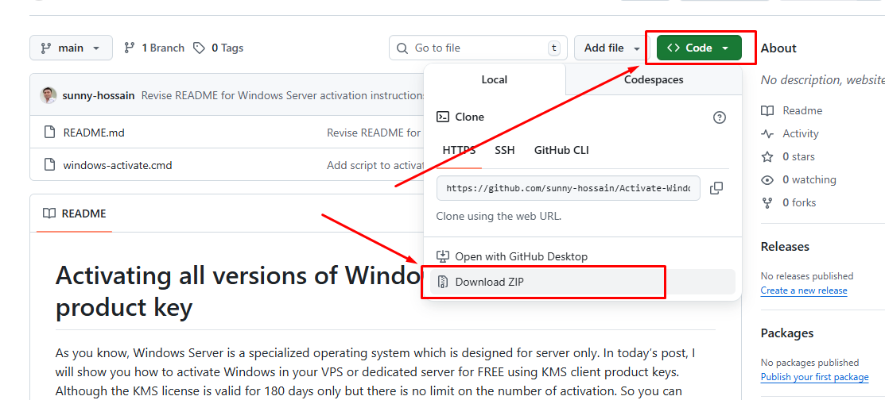
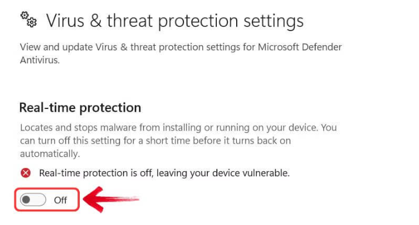
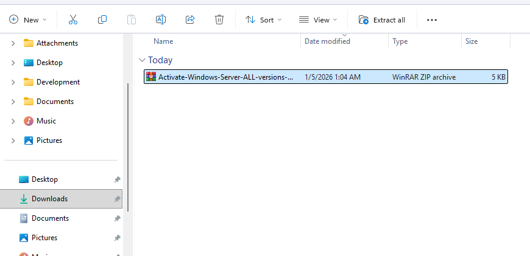
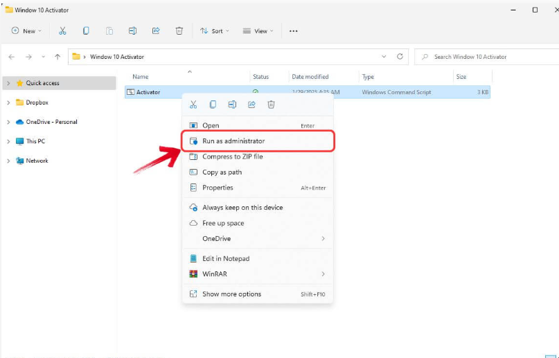
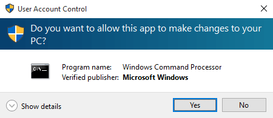
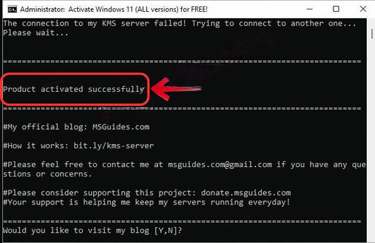
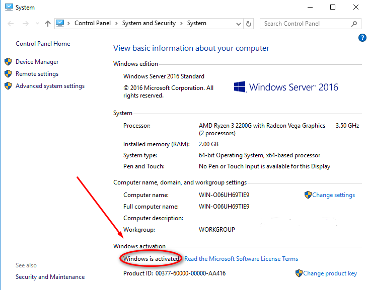
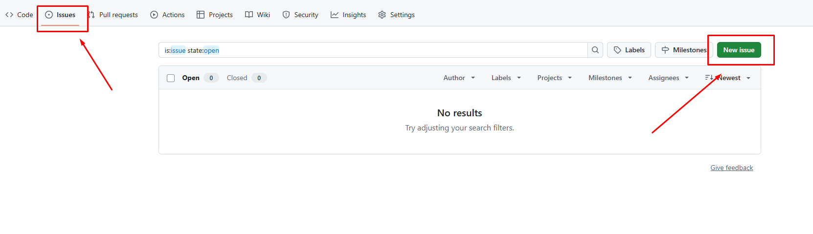

# Activating all versions of Windows Server without a product key ( Windows 8, 10, 11 )
As you know, Windows Server is a specialized operating system which is designed for server only. In today’s post, I will show you how to activate Windows in your VPS or dedicated server for FREE using KMS client product keys. Although the KMS license is valid for 180 days only but there is no limit on the number of activation. So you can renew it whenever you want. Actually, the license will be renewed automatically every 7 days by default (almost similar to [Let’s Encrypt certificate](https://letsencrypt.org/) ). In this way, just do it one time and forget it completely.

### Note:
 ✅ If you are a student, an office worker or any standard user who is using desktop edition of Windows, just skip this post and please do not follow the instructions. I will not be responsible for any damage caused by you. 
 ✅ All editions of Windows Server in the Microsoft homepage are evaluation ones and not supported by KMS. So if you are using an evaluation version, just [convert it to the retail one](https://msguides.com/convert-windows-server-evaluation) before following the instructions below.

### Supported products:
 ✅ Windows Server 2022/2019/2016. 
 ✅ Windows Server, version 1809, 1803, 1709. 
 ✅ Windows Server 2008/2012 (R2

 ## Step 1: Downloading this files.

   👉 [DOWNLOAD NOW](https://github.com/sunny-hossain/activating-all-versions-of-windows-Server-without-a-product-key_windows-8_windows-10_windows-11/archive/refs/heads/main.zip)
 
 

 ## Step 2:  Deactivate The Windows Security
 
 
 
 ## Step 3: Unzip the zip file

 
 
 ## Step 4: Open the Activator.cmd file as Administrator

 
 
 ## Step 5: A warning popup will appear, click “Yes” to proceed with the Windows activation script.

  
  
 ## Step 6: The activator script will run in the Command Prompt, and your Windows will be activated.

  

## Step 7: Restart and Reactivated.

  ✅ Restart your Windows Now. 
  ✅ You can reactivated the windows security.

## Finally, check activation status of your server again.

  

  ### Note: If you are facing a problem then create a new issue.

  

## Enjoy Now!

⚠️ If you have any questions then commment me or create issue.  

